# Welcome to UHelper! 🤖

UHelper is an interactive bot that is designed to meet students' needs on Discord. 

1. [Overview](#overview)
2. [Installation Guide](#installation-guide)
   1. [Running the Bot (Phase 1)](#how-to-run-uhelper-in-a-server-phase-1)
   2. [Running the Bot (Phase 2)](#how-to-run-uhelper-in-a-server-phase-2)
3. [Project Progresses](#project-progresses)
4. [Important Notes](#important-notes)

## Overview

The main goal of UHelper is to assist with time management and wellness. 
Users can create events for exams or assignments at specified times and details. Once scheduled, 
the bot will notify users individually in direct messages a day before the events or an hour before 
if they were scheduled less than a day away. 
For study assistance, they can input questions and answers for UHelper to quiz them later, 
with optional hints available. To help boost students’ productivity and focus, 
the bot can set up a Pomodoro timer, including customizable presets and collaborative features that 
allow multiple users to have a timer in common to work remotely. Additionally, The bot supports 
student wellness by suggesting healthy and handy cooking recipes based on given 
ingredients. If requested, the bot can also display nutritional facts about each dish. During breaks, 
users can engage in mini-games, which track their records, to stay entertained. 

## Installation Guide

### Before You Start: Setting Up a Discord Server.

In order to install UHelper, you have to create your own server or are already an administrator in 
an existing server. If you have not used Discord before or do not know how to work with servers, it 
is recommended that you read through [this beginner's guide](https://support.discord.com/hc/en-us/articles/360045138571-Beginner-s-Guide-to-Discord#h_efc9b7bc-47bc-4212-8b9c-c0fa76573cfe).

### How to Invite UHelper to Your Server

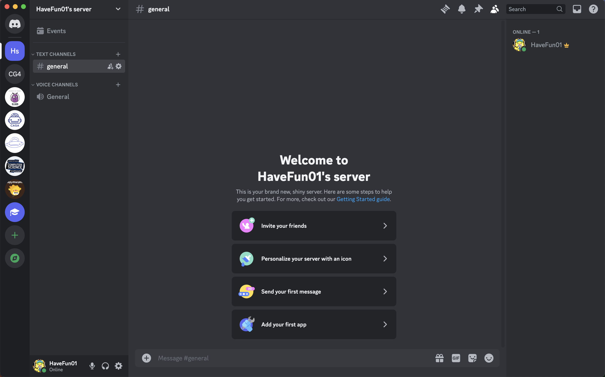

If you can see a screen similar as above, that means you've successfully created your own server. 
You are now ready to invite UHelper to help you through your journey as a student. This 
[link](https://discord.com/oauth2/authorize?client_id=1253813199397191863&permissions=1126727225142272&integration_type=0&scope=bot) will take you to a webpage that prompts you to select which server you want UHelper to
join. 

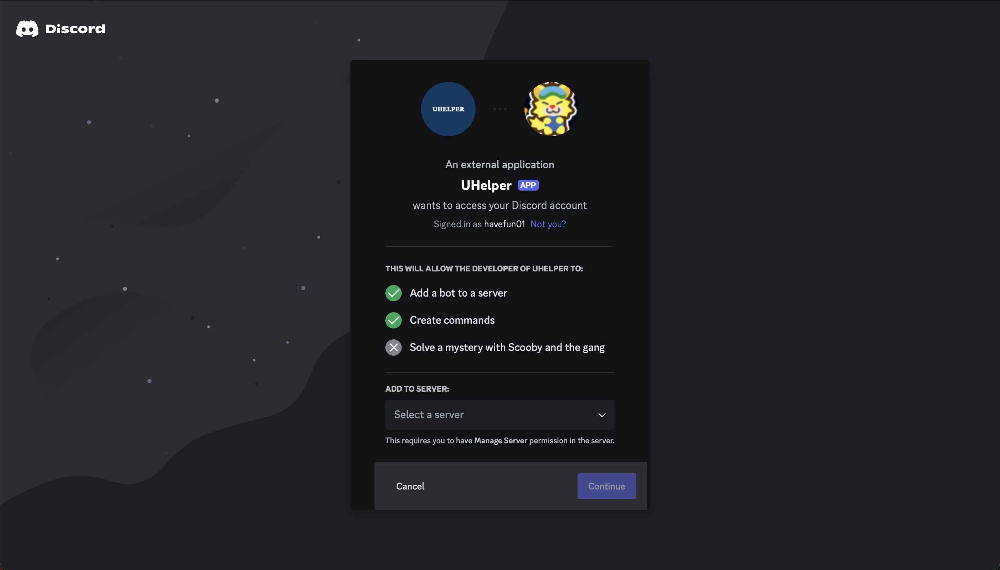

Here, you can select the server you want (it's under the Add to Server section!) and afterward, 
press continue.

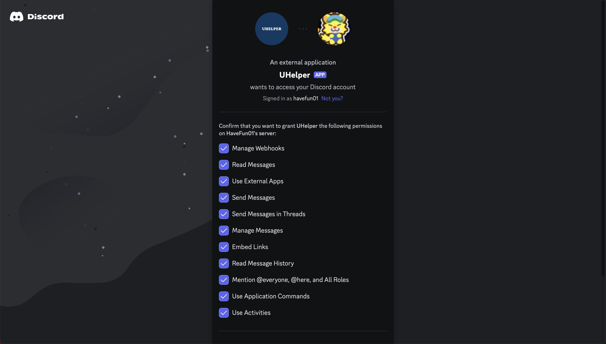

Then, you will be asked to confirm that you wish to grant some permissions to UHelper. Because these 
are all essential for the bot to function, you should not uncheck any one of them. Scroll
down to the bottom to find the "authorize" button and click it.

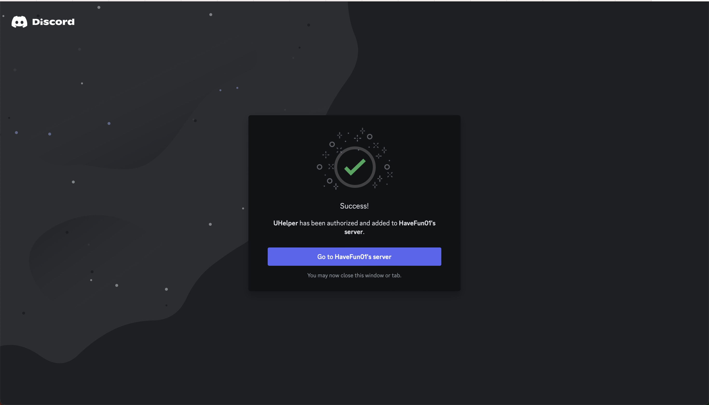

Seeing this screen means that UHelper has successfully joined your server. Congratulations! The next
part of this guide will teach you how to run UHelper.

### How to Run UHelper in a Server (Phase 1)

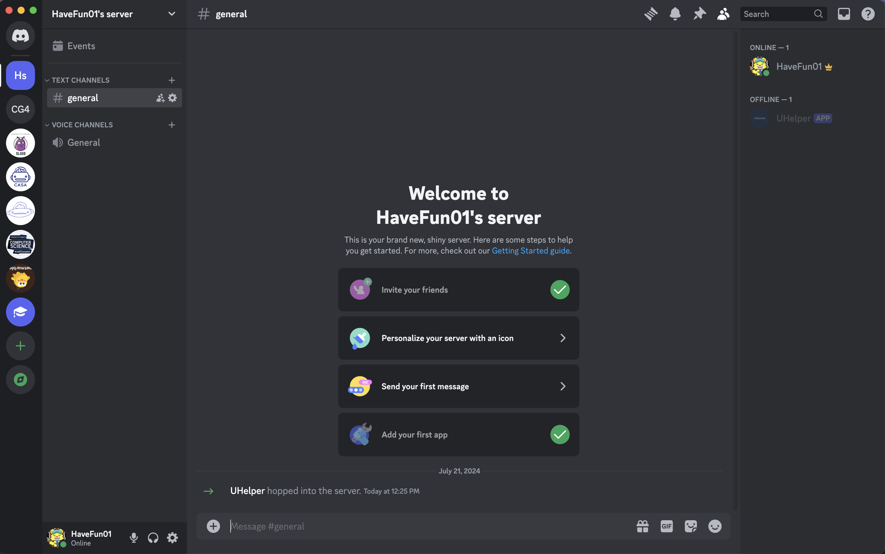

UHelper joined the server, but it cannot listen to your commands as it is not online. Open up 
IntelliJ IDEA and go to ca.unknown.bot.app.Main. Go to Edit Configurations, click Add new run 
configuration, and select Application.

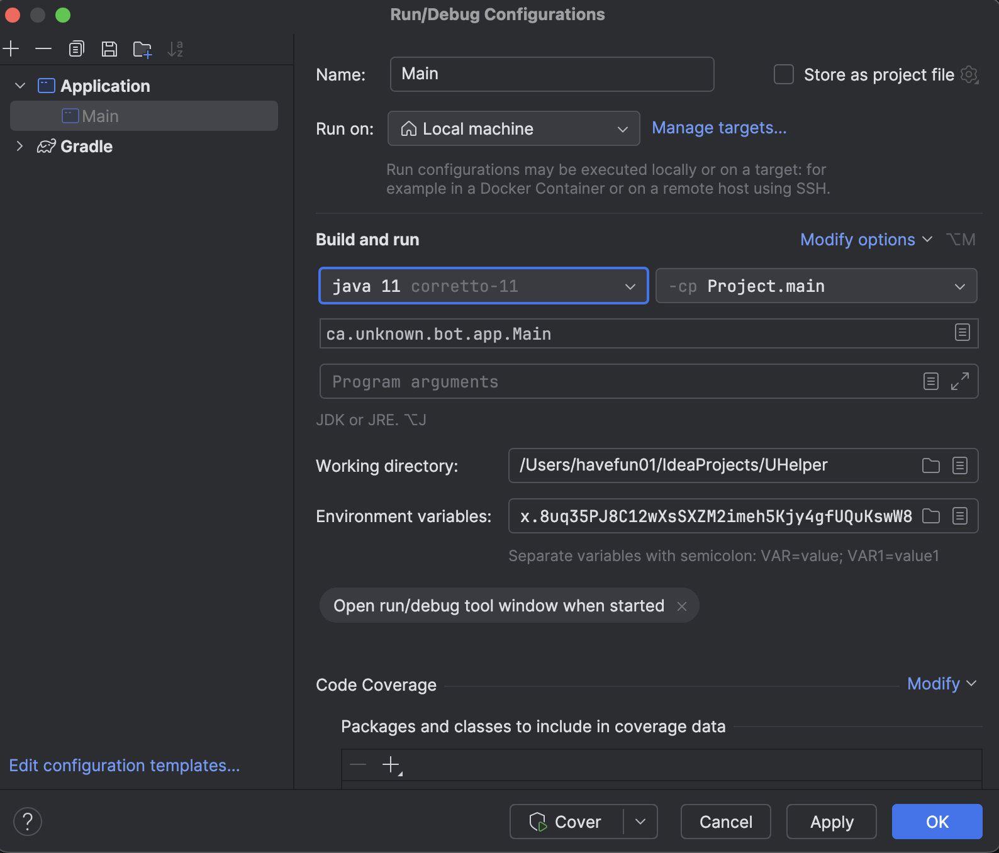

In the edit configuration window, choose Java 11 and Project.Main under the Build and Run section.
For the main class box, type ca.unknown.bot.app.Main. Next, importantly, you should add some bot 
tokens as an environmental variable... but where are the tokens, you ask? Discord enforces 
strict rules to its bot developers and one of them is that you can't post
any bot token online due to security reasons. If you do, it will immediately detect the token and 
automatically disable it. But, you can still have access to the UHelper's tokens! We've attached the 
tokens via the comment section of the Phase 1 submission.

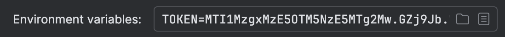

Once you find the tokens, set them up as the environmental variables. To do so, type TYPE={your_token}
in the environmental variables box, as shown in the above screenshot. Click the apply button to save 
these changes. Finally, run the main.java class. 

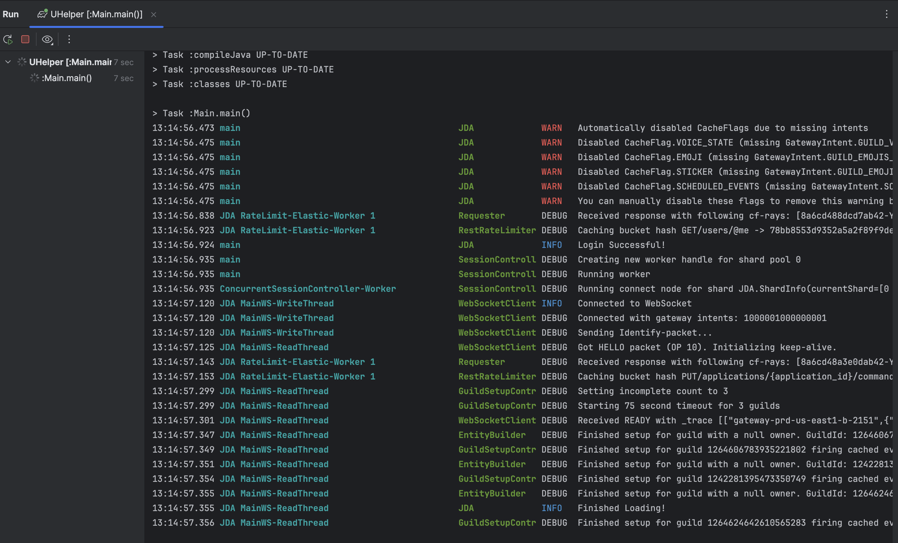

A successful execution of UHelper should look like this. Then, open Discord and go to your server.
The UHelper bot should be online in your server. Stopping UHelper in IntelliJ will cause it to go 
offline.

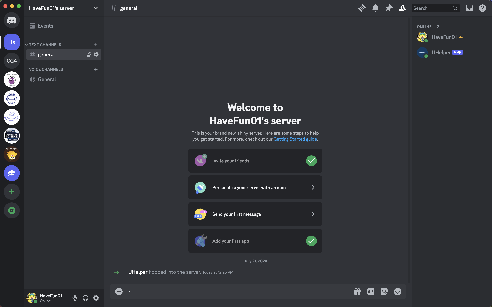

Most of the UHelper's features are accessed through slash commands interaction, so you can simply type `/` in the chat 
to see the commands available! For a quick and friendly guide to all our commands, 
you can use the handy `\uhelper-wiki` guide. This guide allows you to view the entire list of commands 
or dive into a specific feature to see related commands. Explore and enjoy all the awesome capabilities 
UHelper has to offer! 🚀

### How to Run UHelper in a Server (Phase 2)

As of Phase 2, the way you run the UHelper bot is different from the 
"How to Run UHelper in a Server (Phase 1)" section, as there is now a GUI component.

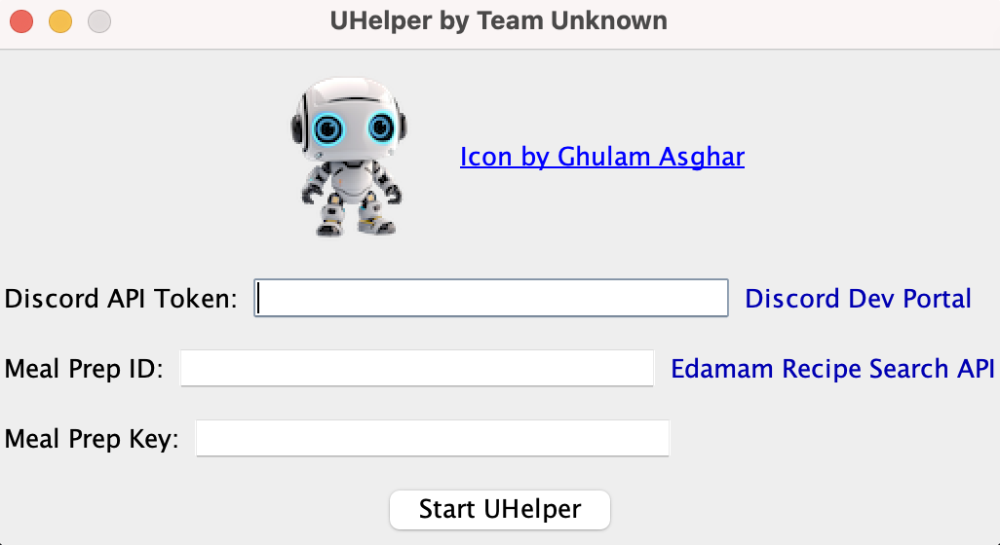

Instead of running Main.java, go to src/main/java/ca/unknown/bot/gui and find GUI.java. 
You should see a Java Swing window that has three boxes for you to enter. Put the tokens we provided
 you with in the phase 1 submission and click start UHelper. 

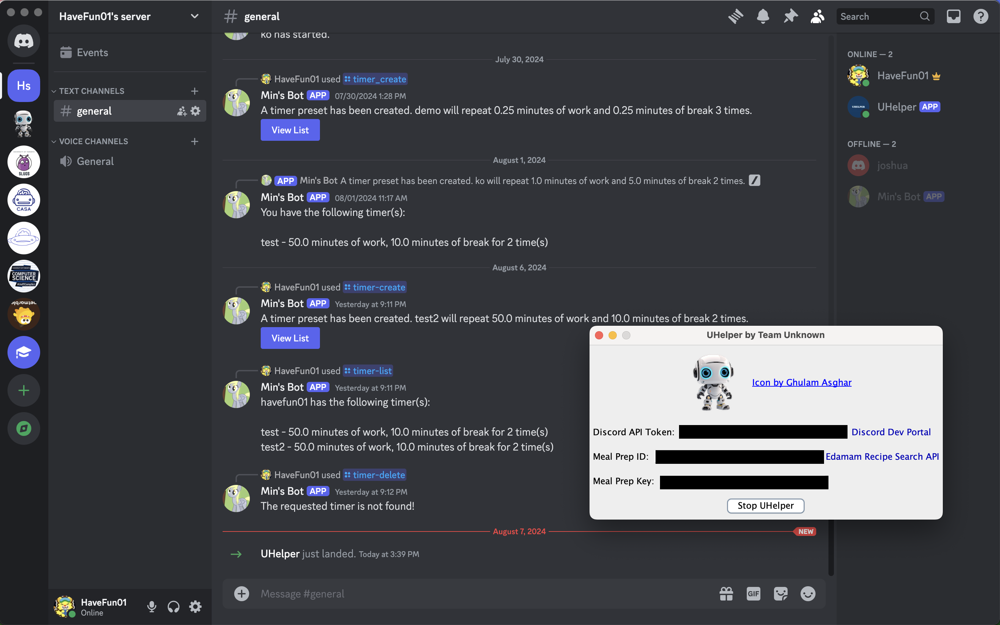

If successful, you should see the bot appearing as online in your server. At any point, you can click
stop UHelper to deactivate it. Enjoy!

## Project Progresses
Currently, we are working to implement the following features. 
You can find all the user stories and other details in our blueprint from [here](https://docs.google.com/document/d/1OcYBGoSZbEqtA47CwSlzFe1wVuZo28Xl-FKUkS_0AUI/edit#heading=h.rwi1fv3j8vi2).

- **Timer** ⏱️
  - [X] Create a timer preset by providing the amount of time wanted for work and break 
  and record it in a json file.
  - [X] Provide a list of the timers that are created by the caller when requested 
  - [X] Start a timer by giving the bot the name of that timer and notify users when time is up 
  via DM. In doing so, the user can invite other users so that they'd be also notified.
  - [X] Cancel an ongoing timer.
  - [X] Delete a timer preset by giving its name. 

- **Minigames** 🎮
  - [X] Rock-paper-scissors
  - [X] Trivia
  - [X] Magic 8 Ball 

- **Study help** 📚
  - [X] Create quizzes, save them and load them later
  - [X] Practice answering them and see progress of score overtime

- **Scheduled Reminders** 📅
  - [X] Create a scheduled event by providing the event name and date (day + time) of the event. (July 14)
    - [X] Create a scheduled assignment by providing the course code, due date, and name of the assignment. (July 5)
    - [X] Create a scheduled exam by providing the course code, location, and date (day + time) of the exam. (July 5)
  - [X] Bot sends scheduled direct message reminders the day before each event or one hour before the event if it was 
  scheduled less than a day away. (July 26)
  - [X] Bot displays a schedule with ongoing events (incl. assignments, general events, and exams). (July 17)
  - [X] Bot clears the user's current schedule. (July 17)
    - [X] Deletes reminder alerts (July 30)
  - [X] Bot clears individual events from the schedule and unsubscribes the user from the reminder alert. (Aug 1)
  - [X] Bot persists the schedule repo to a .json file. (July 20)
  - [X] Schedule repo is persisted if program restarts (August 6)
    - [X] Reminder alerts get restarted
    - [X] Removes any passed events
  - [X] Bot removes passed events from the user's schedule automatically. (August 3)

- **Recipe** 🍽️
  - [X] Implement the API call to fetch recipe data (July 6)
  - [X] Handle multiple optional parameters for recipe search 
    - [X] Encode whitespace and support multiple parameters for API calls 
          (e.g., meal type, diet, dish type, etc.) (July 12)
    - [X] Style parameters and its value for recipe summary (Aug 5)
  - [X] Style recipe suggestions with Embed Builder 
    - [X] Add directions to external recipes, images of the cuisine and Nutritional Information (July 14)
    - [X] Create Paginator template for smoother navigation of recipes (July 18)

- **Wiki** 🔍
  - [X] Implement UHelper Wiki with paginator (Aug 4)

~~- **Motivational Quotes** 💪~~

~~- **Customizable Commands** ⚙️~~

## Important Notes

- [X] **July 21** - [Phase 1](https://q.utoronto.ca/courses/345741/pages/phase-1-10-percent?module_item_id=5764241)
(Access to the course page may be restricted)

- [X] **August 8** - [Final Presentation](https://q.utoronto.ca/courses/345741/pages/presentation-5-percent?module_item_id=5764413)

- [X] **August 15** - [Final Exam (7-10 PM)](https://q.utoronto.ca/courses/345741/pages/final-exam-information-august-15-2024?module_item_id=5872089)

- [X] **August 20** - [Phase 2](https://q.utoronto.ca/courses/345741/pages/phase-2-10-percent?module_item_id=5764412) 
